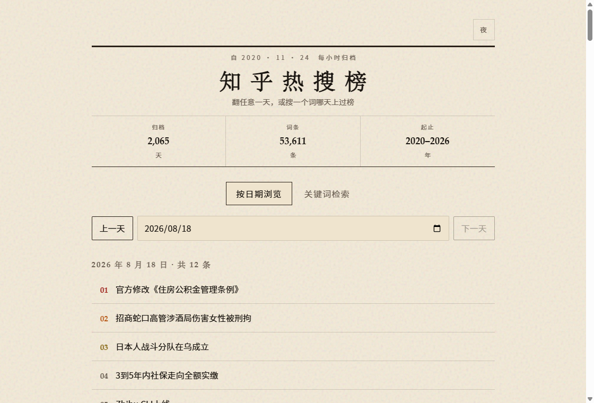
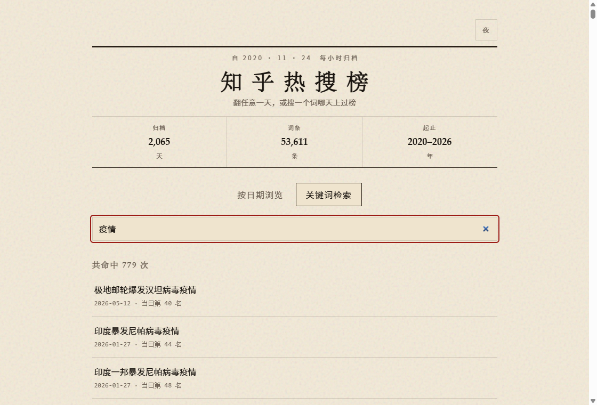

<div align="center">

# 知乎热搜榜

知乎不提供历史热搜。这个仓库从 **2020-11-24** 起每小时抓一次，按天存下来。

两千多天 · 五万多条 · 可按日翻 · 可按词搜

**[打开在线浏览](https://qcmuu.github.io/zhihu-trending-top-search/)**

[](https://github.com/qcmuu/zhihu-trending-top-search/actions)
[](https://qcmuu.github.io/zhihu-trending-top-search/)
[](LICENSE)

<p>
  <a href="https://qcmuu.github.io/zhihu-trending-top-search/"></a>
  <a href="https://qcmuu.github.io/zhihu-trending-top-search/"></a>
</p>

</div>

Hourly archive of Zhihu search trends since 2020-11-24. Browse any day, or search which days a keyword hit the list.

## 今日热搜

<!-- BEGIN -->
<!-- 最后更新时间 Thu Aug 20 2026 18:27:12 GMT+0800 (China Standard Time) -->
1. [网红小家电集体吃灰](https://www.zhihu.com/search?q=%E7%BD%91%E7%BA%A2%E5%B0%8F%E5%AE%B6%E7%94%B5%E9%9B%86%E4%BD%93%E5%90%83%E7%81%B0)
1. [宇树科技大跌](https://www.zhihu.com/search?q=%E5%AE%87%E6%A0%91%E7%A7%91%E6%8A%80%E5%A4%A7%E8%B7%8C)
1. [重庆警方通报时代峰峻楼下人员聚集](https://www.zhihu.com/search?q=%E9%87%8D%E5%BA%86%E8%AD%A6%E6%96%B9%E9%80%9A%E6%8A%A5%E6%97%B6%E4%BB%A3%E5%B3%B0%E5%B3%BB%E6%A5%BC%E4%B8%8B%E4%BA%BA%E5%91%98%E8%81%9A%E9%9B%86)
1. [Zhihu CLI上线](https://www.zhihu.com/search?q=Zhihu%20CLI%E4%B8%8A%E7%BA%BF)
1. [许家印两个儿子也判了](https://www.zhihu.com/search?q=%E8%AE%B8%E5%AE%B6%E5%8D%B0%E4%B8%A4%E4%B8%AA%E5%84%BF%E5%AD%90%E4%B9%9F%E5%88%A4%E4%BA%86)
1. [恒大集团被罚 88.2 亿元](https://www.zhihu.com/search?q=%E6%81%92%E5%A4%A7%E9%9B%86%E5%9B%A2%E8%A2%AB%E7%BD%9A%2088.2%20%E4%BA%BF%E5%85%83)
1. [《黑神话：钟馗》发布实机演示视频](https://www.zhihu.com/search?q=%E3%80%8A%E9%BB%91%E7%A5%9E%E8%AF%9D%EF%BC%9A%E9%92%9F%E9%A6%97%E3%80%8B%E5%8F%91%E5%B8%83%E5%AE%9E%E6%9C%BA%E6%BC%94%E7%A4%BA%E8%A7%86%E9%A2%91)
1. [招商蛇口高管涉酒局伤害女性被刑拘](https://www.zhihu.com/search?q=%E6%8B%9B%E5%95%86%E8%9B%87%E5%8F%A3%E9%AB%98%E7%AE%A1%E6%B6%89%E9%85%92%E5%B1%80%E4%BC%A4%E5%AE%B3%E5%A5%B3%E6%80%A7%E8%A2%AB%E5%88%91%E6%8B%98)
1. [高铁 2 人 3 票占座放零食引争议](https://www.zhihu.com/search?q=%E9%AB%98%E9%93%81%202%20%E4%BA%BA%203%20%E7%A5%A8%E5%8D%A0%E5%BA%A7%E6%94%BE%E9%9B%B6%E9%A3%9F%E5%BC%95%E4%BA%89%E8%AE%AE)
1. [宇树总市值已跌超1500亿](https://www.zhihu.com/search?q=%E5%AE%87%E6%A0%91%E6%80%BB%E5%B8%82%E5%80%BC%E5%B7%B2%E8%B7%8C%E8%B6%851500%E4%BA%BF)
1. [许家印被判处无期徒刑](https://www.zhihu.com/search?q=%E8%AE%B8%E5%AE%B6%E5%8D%B0%E8%A2%AB%E5%88%A4%E5%A4%84%E6%97%A0%E6%9C%9F%E5%BE%92%E5%88%91)
1. [朱雀三号成功回收](https://www.zhihu.com/search?q=%E6%9C%B1%E9%9B%80%E4%B8%89%E5%8F%B7%E6%88%90%E5%8A%9F%E5%9B%9E%E6%94%B6)
<!-- END -->

按天的 Markdown 在 [archives](./archives)，机器可读的 JSON 在 [raw](./raw)。缺了哪些天写在 [archives/MISSING.md](./archives/MISSING.md)，目前大约 20 天，补不回来。

## 数据长什么样

`raw/2020-11-24.json` 一类，一天一个文件：

```json
[
  { "query": "嫦娥五号", "display_query": "嫦娥五号发射成功" }
]
```

`display_query` 是榜上那行字，`query` 是点进去搜的词。同一天里按 `display_query` 去重。一天会采很多次，文件是并集，不是某一小时的完整排名快照。

静态站用的是 [web/index.json](./web/index.json)：按日期压成 `[display_query, query]`，数组下标就是当天顺序。浏览器一次性加载，检索在本地做。

## 采集

GitHub Actions 每小时跑一次。先拉 `recommend_query/v2`，空了再回退 `top_search`。当天的 JSON / 归档是各小时并集；README 里的「今日热搜」只写这一次抓到的榜。日期按上海日历算，不看 runner 时区。

自己跑的话需要 [Deno](https://deno.com/)，然后：

```bash
deno run --allow-net --allow-read --allow-write --import-map=import_map.json mod.ts
deno run --allow-read --allow-write --import-map=import_map.json build_index.ts
```

Fork 之后打开 Actions 即可继续采。静态站没有后端，把 `web/` 丢到任意静态托管就能用。

## 来源

采集思路来自 [justjavac/zhihu-trending-top-search](https://github.com/justjavac/zhihu-trending-top-search)。本仓库在归档之外加了可检索的静态站。

同系列：

- [知乎热门话题](https://github.com/justjavac/zhihu-trending-hot-questions)
- [知乎热门视频](https://github.com/justjavac/zhihu-trending-hot-video)
- [微博热搜榜](https://github.com/justjavac/weibo-trending-hot-search)

## License

[MIT](LICENSE)
