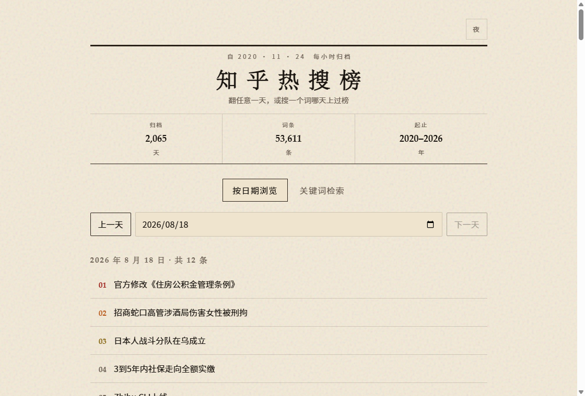
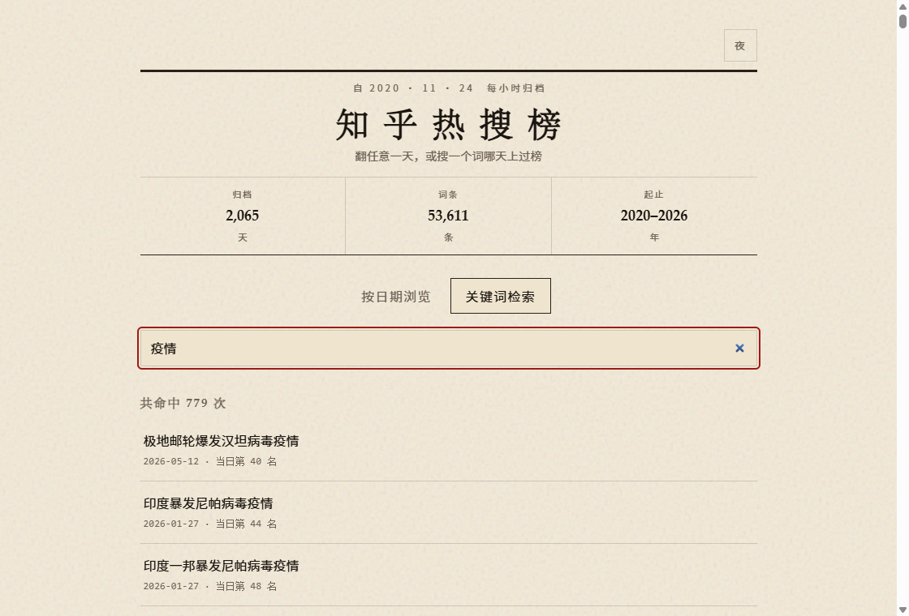

<div align="center">

# 知乎热搜榜

知乎不提供历史热搜。这个仓库从 **2020-11-24** 起每小时抓一次，按天存下来。

两千多天 · 五万多条 · 可按日翻 · 可按词搜

**[打开在线浏览](https://qcmuu.github.io/zhihu-trending-top-search/)**

[](https://github.com/qcmuu/zhihu-trending-top-search/actions)
[](https://qcmuu.github.io/zhihu-trending-top-search/)
[](LICENSE)

<p>
  <a href="https://qcmuu.github.io/zhihu-trending-top-search/"></a>
  <a href="https://qcmuu.github.io/zhihu-trending-top-search/"></a>
</p>

</div>

Hourly archive of Zhihu search trends since 2020-11-24. Browse any day, or search which days a keyword hit the list.

## 今日热搜

<!-- BEGIN -->
<!-- 最后更新时间 Sat Oct 10 2026 10:04:32 GMT+0800 (China Standard Time) -->
1. [宋佳获飞天奖视后](https://www.zhihu.com/search?q=%E5%AE%8B%E4%BD%B3%E8%8E%B7%E9%A3%9E%E5%A4%A9%E5%A5%96%E8%A7%86%E5%90%8E)
1. [王仁君首获飞天奖视帝](https://www.zhihu.com/search?q=%E7%8E%8B%E4%BB%81%E5%90%9B%E9%A6%96%E8%8E%B7%E9%A3%9E%E5%A4%A9%E5%A5%96%E8%A7%86%E5%B8%9D)
1. [711关闭印度全部门店](https://www.zhihu.com/search?q=711%E5%85%B3%E9%97%AD%E5%8D%B0%E5%BA%A6%E5%85%A8%E9%83%A8%E9%97%A8%E5%BA%97)
1. [白俄女模特被骗至缅甸遭杀害](https://www.zhihu.com/search?q=%E7%99%BD%E4%BF%84%E5%A5%B3%E6%A8%A1%E7%89%B9%E8%A2%AB%E9%AA%97%E8%87%B3%E7%BC%85%E7%94%B8%E9%81%AD%E6%9D%80%E5%AE%B3)
1. [OpenAI宣布解决准黎曼猜想](https://www.zhihu.com/search?q=OpenAI%E5%AE%A3%E5%B8%83%E8%A7%A3%E5%86%B3%E5%87%86%E9%BB%8E%E6%9B%BC%E7%8C%9C%E6%83%B3)
1. [樊振东回归救不了国乒人才断档](https://www.zhihu.com/search?q=%E6%A8%8A%E6%8C%AF%E4%B8%9C%E5%9B%9E%E5%BD%92%E6%95%91%E4%B8%8D%E4%BA%86%E5%9B%BD%E4%B9%92%E4%BA%BA%E6%89%8D%E6%96%AD%E6%A1%A3)
1. [巴拿马7.6级地震](https://www.zhihu.com/search?q=%E5%B7%B4%E6%8B%BF%E9%A9%AC7.6%E7%BA%A7%E5%9C%B0%E9%9C%87)
1. [俄罗斯不明病因肺炎事件四种说法](https://www.zhihu.com/search?q=%E4%BF%84%E7%BD%97%E6%96%AF%E4%B8%8D%E6%98%8E%E7%97%85%E5%9B%A0%E8%82%BA%E7%82%8E%E4%BA%8B%E4%BB%B6%E5%9B%9B%E7%A7%8D%E8%AF%B4%E6%B3%95)
1. [字节Seed团队发现DeepSeek性能漂移](https://www.zhihu.com/search?q=%E5%AD%97%E8%8A%82Seed%E5%9B%A2%E9%98%9F%E5%8F%91%E7%8E%B0DeepSeek%E6%80%A7%E8%83%BD%E6%BC%82%E7%A7%BB)
1. [俄解除不明原因肺炎防疫措施](https://www.zhihu.com/search?q=%E4%BF%84%E8%A7%A3%E9%99%A4%E4%B8%8D%E6%98%8E%E5%8E%9F%E5%9B%A0%E8%82%BA%E7%82%8E%E9%98%B2%E7%96%AB%E6%8E%AA%E6%96%BD)
1. [多家烘焙店下架超长蛋挞](https://www.zhihu.com/search?q=%E5%A4%9A%E5%AE%B6%E7%83%98%E7%84%99%E5%BA%97%E4%B8%8B%E6%9E%B6%E8%B6%85%E9%95%BF%E8%9B%8B%E6%8C%9E)
1. [缅北电诈犯随机杀陌生人祭天](https://www.zhihu.com/search?q=%E7%BC%85%E5%8C%97%E7%94%B5%E8%AF%88%E7%8A%AF%E9%9A%8F%E6%9C%BA%E6%9D%80%E9%99%8C%E7%94%9F%E4%BA%BA%E7%A5%AD%E5%A4%A9)
<!-- END -->

按天的 Markdown 在 [archives](./archives)，机器可读的 JSON 在 [raw](./raw)。缺了哪些天写在 [archives/MISSING.md](./archives/MISSING.md)，目前大约 20 天，补不回来。

## 数据长什么样

`raw/2020-11-24.json` 一类，一天一个文件：

```json
[
  { "query": "嫦娥五号", "display_query": "嫦娥五号发射成功" }
]
```

`display_query` 是榜上那行字，`query` 是点进去搜的词。同一天里按 `display_query` 去重。一天会采很多次，文件是并集，不是某一小时的完整排名快照。

静态站用的是 [web/index.json](./web/index.json)：按日期压成 `[display_query, query]`，数组下标就是当天顺序。浏览器一次性加载，检索在本地做。

## 采集

GitHub Actions 每小时跑一次。先拉 `recommend_query/v2`，空了再回退 `top_search`。当天的 JSON / 归档是各小时并集；README 里的「今日热搜」只写这一次抓到的榜。日期按上海日历算，不看 runner 时区。

自己跑的话需要 [Deno](https://deno.com/)，然后：

```bash
deno run --allow-net --allow-read --allow-write --import-map=import_map.json mod.ts
deno run --allow-read --allow-write --import-map=import_map.json build_index.ts
```

Fork 之后打开 Actions 即可继续采。静态站没有后端，把 `web/` 丢到任意静态托管就能用。

## 来源

采集思路来自 [justjavac/zhihu-trending-top-search](https://github.com/justjavac/zhihu-trending-top-search)。本仓库在归档之外加了可检索的静态站。

同系列：

- [知乎热门话题](https://github.com/justjavac/zhihu-trending-hot-questions)
- [知乎热门视频](https://github.com/justjavac/zhihu-trending-hot-video)
- [微博热搜榜](https://github.com/justjavac/weibo-trending-hot-search)

## License

[MIT](LICENSE)
